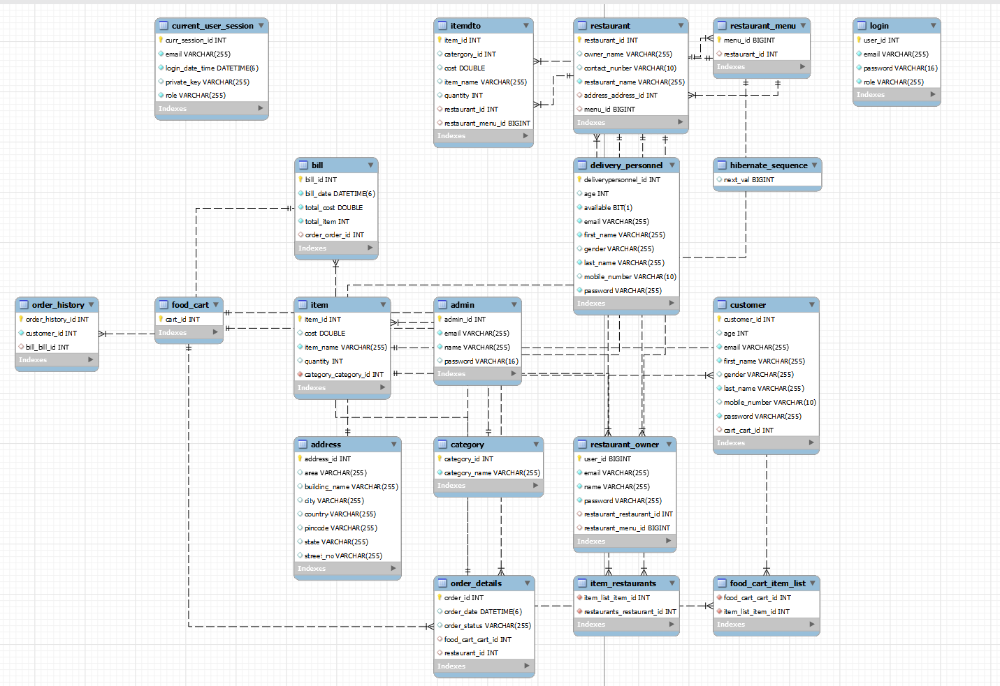
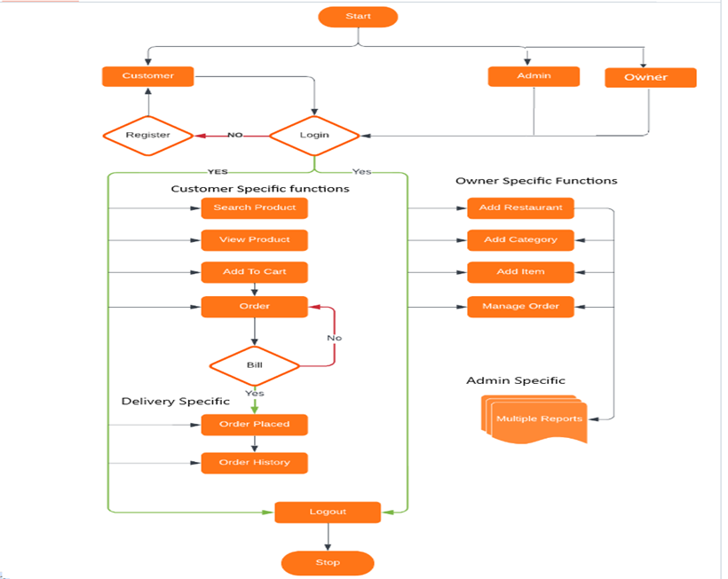

# Multi Bite (Online Food Delivery System)

<li>An online Food Delivery Application having backend REST-API, made in Java Spring Boot, JPA-Hibernate with MySQL database.
<li> This project is developed by team of 3 Back-end Developers during M.Tech at BITS Pilani.
 
 
## Used Tech Stack & Tools:
1. JAVA
2. Spring
3. Spring Boot
4. Spring data JPA
5. Hibernate
6. MySQL
7. Git
8. GitHub

[]()

## Modules
1. Login Module
2. Customer Module
3. Restaurant Module
4. Order Module
5. Bill Module
6. Item Module
7. Cart Module
8. Exception Module

## Installation & Run

1. clone our Project into your local machine.
      - open any terminal
      - git clone https://github.com/jsp268/MultiBite-Food-Delivery-App.git
2. Open Your STS
3. Goto File -> Import -> Select Maven -> Choose Existing Maven -> Click on browse -> Choose the project location -> Select the project -> Finish
4. All done, good to go!

* Application is deployed on AWS EC2 instance here - http://ec2-13-60-205-86.eu-north-1.compute.amazonaws.com:8088/
* Example API - http://ec2-13-60-205-86.eu-north-1.compute.amazonaws.com:8088/customers/all?key=key123
* Swagger API Documentation - http://ec2-13-60-205-86.eu-north-1.compute.amazonaws.com:8088/swagger-ui/index.html#
* As the application is integrated with the role-base access, please use below keys for accessing the APIs. 
Customer - key123
Admin - key456
* If you're using a local database instead of AWS RDS, use the login API to generate the key dynamically
* Before running the API server, you should update the database config inside the application.properties file. 
* Update the port number, username and password as per your local database config.

```
    #db specific properties
    server.port=8088
    
    spring.datasource.url=jdbc:mysql://localhost:3306/demo;
    spring.datasource.driver-class-name=com.mysql.cj.jdbc.Driver
    spring.datasource.username="Your SQL username"
    spring.datasource.password="Your SQL Password"
    
    #ORM s/w specific properties
    spring.jpa.hibernate.ddl-auto=update
    spring.jpa.show-sql=true
    
    #validation exception activate
    spring.mvc.throw-exception-if-no-handler-found=true

    spring.web.resources.add-mappings=false
    
    #enable swagger
    spring.mvc.pathmatch.matching-strategy = ANT_PATH_MATCHER

```

## ER Diagram



## Application Workflow



## Contributors

* JELLA SAI PRANEETH 2023mt93395
* SAYALI GOVIND KADAM 2023mt93165
* PALAMPATLA HRITHIK ROSHAN 2023mt93200
